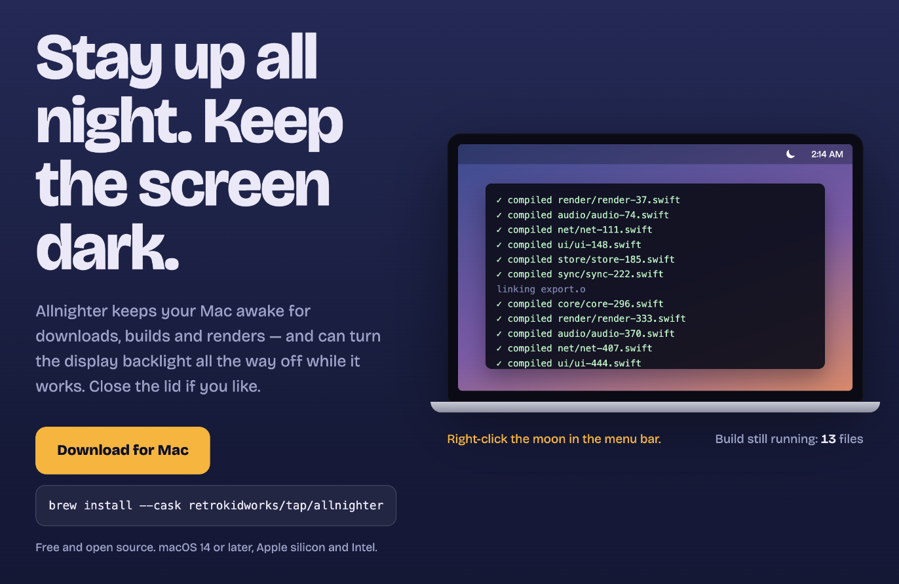

# Allnighter

[](https://allnighter.retrokidworks.com)

A macOS menu bar app that keeps your Mac awake — with the screen actually off.
**[allnighter.retrokidworks.com](https://allnighter.retrokidworks.com)**

Most keep-awake apps leave the display glowing. Allnighter can drop the built-in
display's backlight to zero while your Mac keeps working, and put it back exactly
where it was when you stop. It can also keep a MacBook awake with the lid closed.

## What it does

**Stay awake.** A session starts as soon as the app launches. Start indefinitely or for 15 minutes to 8 hours. Stop any time.

**Dim display when idle.** Pick a delay — 1 to 30 minutes (5 by default), or turn it off. While a session is on
and you haven't touched the mouse or keyboard for that long, the built-in
backlight drops all the way to zero (not a black overlay — the backlight itself).
Touch anything and it comes straight back to where it was. Your brightness is
saved to disk first, so even a force-quit mid-session is restored on next launch.

**Stay awake with lid closed.** Keeps a MacBook running with the lid shut.
This uses a small privileged helper
(see below). If the app goes away for any reason, the helper turns the setting
back off on its own.

## Install

Download the latest `.dmg` from [Releases](https://github.com/retrokidworks/allnighter/releases).

Requires macOS 14 or later.

## How it works

| Feature | macOS mechanism |
| --- | --- |
| Stay awake | `IOPMAssertionCreateWithName` (public API) |
| Dim display | `DisplayServicesSetBrightness` (private framework, loaded at runtime) |
| Lid closed | `SleepDisabled` power setting — the same thing `pmset disablesleep 1` sets |

The lid-closed setting needs root and, unlike a power assertion, it survives the
process that set it. So it lives in a LaunchDaemon (`AllnighterHelper`),
registered with `SMAppService` — macOS asks you to allow it once in
System Settings › General › Login Items. The helper:

- only accepts connections from Allnighter signed by the same team,
- turns the setting off the moment the app's connection drops (quit, crash, force-quit),
- turns it off whenever it starts (so a reboot never leaves it stuck on),
- re-applies it when the power source changes.

Because two of these use private APIs, the full-featured build is distributed
here, outside the Mac App Store. An App Store build (`AllnighterAppStore` target)
compiles those parts out entirely.

## Build

```sh
brew install xcodegen
xcodegen generate
xcodebuild -project Allnighter.xcodeproj -scheme Allnighter -configuration Release build
```

To sign with your own team, change `DEVELOPMENT_TEAM` in `project.yml` and the
team ID in `Shared/helper-protocol.swift`.

## Support

If Allnighter saves you some trouble, you can buy me a coffee on
[GitHub Sponsors](https://github.com/sponsors/retrokidworks) — one-time or monthly.

Or in crypto. USDT, USDC, ETH or BNB on BNB Smart Chain, Ethereum or any other EVM network:

```
0x3350b5f57070Aef337C4B78F0c72266D3b1c4EBD
```

## License

MIT
